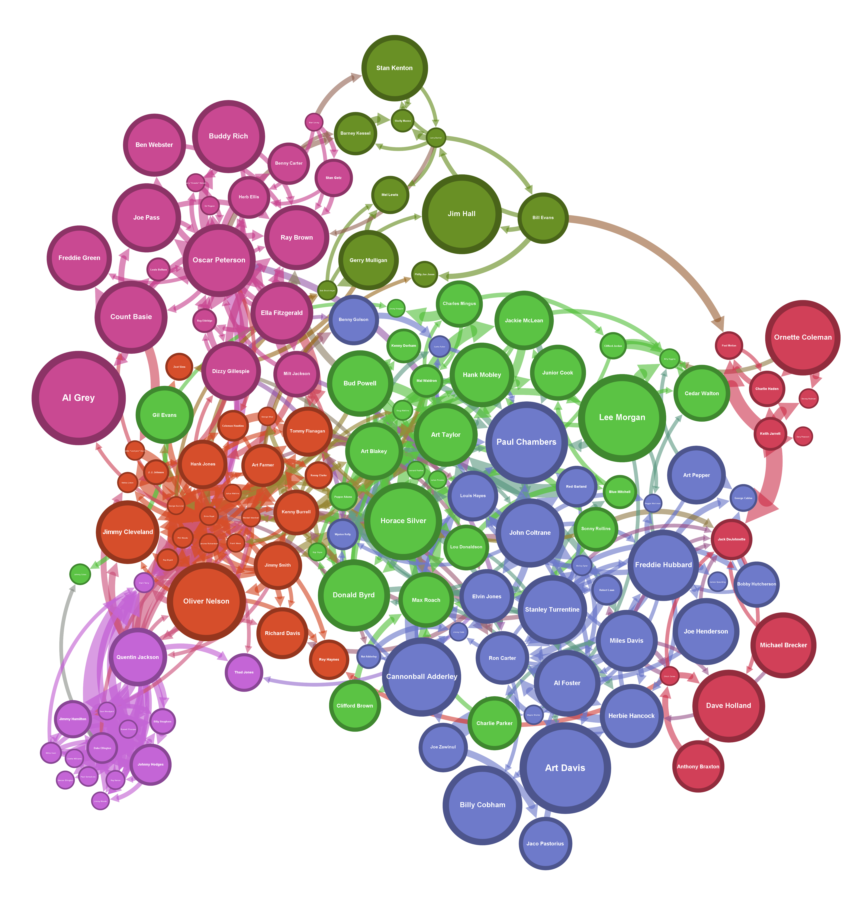

# Jazz Artists Visualization 🎷

## Description:

### Brief:
An exploration in how closely related jazz artists are through network graph visualization. This project uses nodes to represent individual artists, clustering them based on the number of albums they have collaborated on together. Node size is determined by Google search data on each artist from the last 5 years, with bigger nodes representing higher searches. Nodes are colored by their [modularity class](https://en.wikipedia.org/wiki/Modularity_(networks)).

### Data Generation:
Node and edge lists were constructed from personnel listings on over 4000 unique albums. This project used [BeautifulSoup](https://pypi.org/project/beautifulsoup4/) to handle all web scraping.

You can view the node and edge lists used to create this visualization in the `data` folder of the repository.

## Results:

## References:

This project was inspired by the project ["Visualizing Twitch Communities"](https://github.com/KiranGershenfeld/VisualizingTwitchCommunities) by Kiran Gershenfeld.

## Limitations:

I tried to scale nodes by artist popularity using Google search trend, but this metric might not be the best measure of popularity. I chose this metric because it was easy to program and seems to provide semi-accurate results. However, there may be more accurate metrics to explore.

## How to Build the Project:

I have included the node and edge lists used to create the graph in the data folder. However, if you wish to build out the data set programmatically, follow the instructions below.

### Instructions:
1. Run `env_config.sh` to set up the python virtual environment and install necessary dependencies
2. Run `build_manual.sh` or `build_automated.sh` to execute all necessary python scripts. **This will take a while; the data generation process is LENGTHY.**
3. Check out the new files created in the `data` folder

## Tools Used:
* [pandas (python library)](https://pandas.pydata.org/): Data analysis / manipulation
* [BeautifulSoup (python library)](https://pypi.org/project/beautifulsoup4/): Web scraping
* [Gephi](https://gephi.org/): Data visualization
* Full list of dependencies listed in `docs/project-dependencies.md`